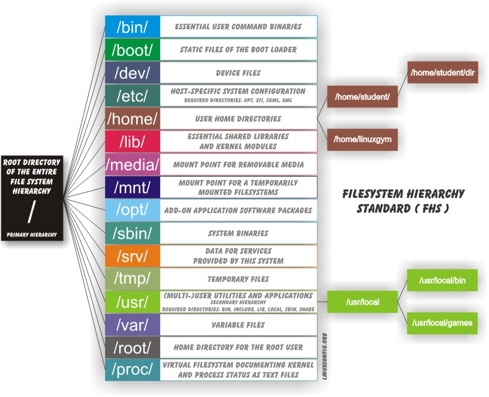

# INTRODUÇÃO AO LINUX

## Tópicos
- 1. [História](#1-historia)
- # 2. [Distros](#2-distros)
- 3. [Interface gráfica](3#-interface-grafica)
    - 3.1 Aplicações na Internet
- 4. [Linhas de Comando](4#-linhas-comando)
    - 4.1 Documentação Linux
    - 4.2 Processos
- 5. [Operações com Arquivos](5#-operar-arquivos)
- 6. [Editores de Texto](6#-editores-texto)
    - 6.1 Ambiente User
    - 6.2 Manipulaçao de texto
- 7. [Operações com Conexões de Rede](7#-conexoes-rede)
- 8. [Bash e scripting](#8-bash)
    - 8.1 Shell Script
- 9. [Segurança](9#-seguranca)

# 2. Distribuições

| Família | Distribuições Principais | Gerenciador de Pacotes | Relação Upstream / Downstream | Uso e Diferenciais |
| :--- | :--- | :--- | :--- | :--- |
| **Red Hat** | RHEL, Fedora, CentOS Stream, Oracle Linux | **dnf** (baseado em RPM) | **Fedora** é upstream do RHEL. **CentOS Stream** recebe atualizações antes do RHEL. | **RHEL**: Padrão corporativo. **Fedora**: Testes e novas tecnologias. **CentOS**: Clone estável (v8 encerrado em 2021). |
| **SUSE** | SLES, openSUSE | **zypper** (baseado em RPM) | **SLES** é upstream do openSUSE. | Muito utilizado no setor de varejo. Inclui o **YaST** (ferramenta de configuração e administração). |
| **Debian** | Debian, Ubuntu, Linux Mint | **APT** (baseado em DPKG) | **Debian** é upstream do Ubuntu. **Ubuntu** é upstream do Mint. | **Debian**: Foco total em estabilidade e software livre. **Ubuntu**: Equilíbrio entre facilidade e estabilidade; líder em nuvem (Cloud). |
***

 
 

O ***YaST (Yet another Setup Tool)*** é uma ferramenta exclusiva da família SUSE que centraliza tudo: desde a instalação de programas até configurações profundas do kernel e hardware. No openSUSE, ele é o gerenciador gráfico principal.

Historicamente, o Linux utilizava o SysVinit, um método sequencial baseado em scripts e níveis de execução (runlevels). No entanto, esse modelo tornou-se obsoleto por ser lento e não aproveitar o processamento paralelo dos computadores modernos.

Duas alternativas principais surgiram para acelerar e modernizar o sistema:

**Upstart**: Criado pela Ubuntu em 2006, teve adoção temporária em várias distros, mas acabou perdendo espaço.

**systemd**: Tornou-se o padrão atual em quase todas as grandes distribuições pois sua adoção universal simplificou o gerenciamento de sistemas Linux.

O FHS é um conjunto de diretrizes mantido pela Linux Foundation que define onde os arquivos e diretórios devem ser colocados. Isso garante que administradores e desenvolvedores consigam operar em qualquer distribuição Linux sem precisar reaprender a estrutura do sistema.

**Caminhos:** Utiliza-se a barra comum (**/**) para separar diretórios;

**Sem Letras de Unidade:** Todos os discos e partições são considerados diretórios dentro de uma única árvore que começa na raiz (**/**).

**Mídias Removíveis:** Pendrives e CDs aparecem geralmente em **/run/media/usuario/nome_do_disco**  ou em **/media** (sistemas antigos).
 
 

**[Seguir para a página anterior ←](1-História.md)**

 

**[Seguir para a próxima página →](3-Interface_grafica.md)**

## 🔗 Recursos Úteis

Links de recursos extras além do próprio material do curso.

- [Documentação Uuntu](https://help.ubuntu.com/);
- [Documentação CentOS](https://wiki.centos.org/Documentation);
- [Documentação OpenSUSE](https://doc.opensuse.org/);
- [Documentação Gentoo](https://www.gentoo.org/support/documentation/);
- [Documentação Fedora](https://docs.fedoraproject.org/);

 
 

- **Atividades:**
* [Try It Yourself 1 - mudando o background do desktop](https://www.youtube.com/watch?v=bxvEv7jp1x0)
* [Try It Yourself 2 - mudando de users no Ubuntu](http://linuxfoundation.s3-website-us-east-1.amazonaws.com/TIY/switchuserubuntu/index.html)
* [Try It Yourself 3 - acessando diretórios](http://linuxfoundation.s3-website-us-east-1.amazonaws.com/TIY/usingcd/index.html)
* [Try It Yourself 4 - trabalhando com arquivos e diretórios](http://linuxfoundation.s3-website-us-east-1.amazonaws.com/TIY/usingfilesdirs/index.html)
* [Try It Yourself 5 - localizando arquivos](http://linuxfoundation.s3-website-us-east-1.amazonaws.com/TIY/usingfilesdirs/index.html)
* [Try It Yourself 6 - utilizando ls](http://linuxfoundation.s3-website-us-east-1.amazonaws.com/TIY/usinglswildcards/index.html)
* [Try It Yourself 7 - comparando arquivos](http://linuxfoundation.s3-website-us-east-1.amazonaws.com/TIY/usingdiff/index.html)
* [Try It Yourself 8 - usando file](http://linuxfoundation.s3-website-us-east-1.amazonaws.com/TIY/usingfile/index.html)
* [Try It Yourself 9 - identificando user](http://linuxfoundation.s3-website-us-east-1.amazonaws.com/TIY/usingwho/index.html)
* [Try It Yourself 10 - usando cat](http://linuxfoundation.s3-website-us-east-1.amazonaws.com/TIY/usingcat/index.html)
* [Try It Yourself 11 - usando echo](http://linuxfoundation.s3-website-us-east-1.amazonaws.com/TIY/usingecho/index.html)
* [Try It Yourself 12 - usando head e tail](http://linuxfoundation.s3-website-us-east-1.amazonaws.com/TIY/usingecho/index.html)
* [Try It Yourself 13 - usando sort e uniq](http://linuxfoundation.s3-website-us-east-1.amazonaws.com/TIY/usingsort/index.html)
* [Try It Yourself 14 - usando tr](http://linuxfoundation.s3-website-us-east-1.amazonaws.com/TIY/usingsort/index.html)
* [Try It Yourself 15 - usando wc](http://linuxfoundation.s3-website-us-east-1.amazonaws.com/TIY/usingwc/index.html)
* [Try It Yourself 16 - usando DNS](http://linuxfoundation.s3-website-us-east-1.amazonaws.com/TIY/usinghost/index.html)
* [Try It Yourself 17 - usando ping, route, and traceroute](http://linuxfoundation.s3-website-us-east-1.amazonaws.com/TIY/usingping/index.html)
* [Try It Yourself 18 - usando ferramentas de network](http://linuxfoundation.s3-website-us-east-1.amazonaws.com/TIY/usingethtool/index.html)
* [Try It Yourself 19 - usando wget e curl](http://linuxfoundation.s3-website-us-east-1.amazonaws.com/TIY/usingwgetcurl/index.html)
* [Try It Yourself 20 - imprimindo com lp](http://linuxfoundation.s3-website-us-east-1.amazonaws.com/TIY/usinglp/index.html)
* [Try It Yourself 21 - gerenciando impressões](http://linuxfoundation.s3-website-us-east-1.amazonaws.com/TIY/usinglp/index.html)

--- 